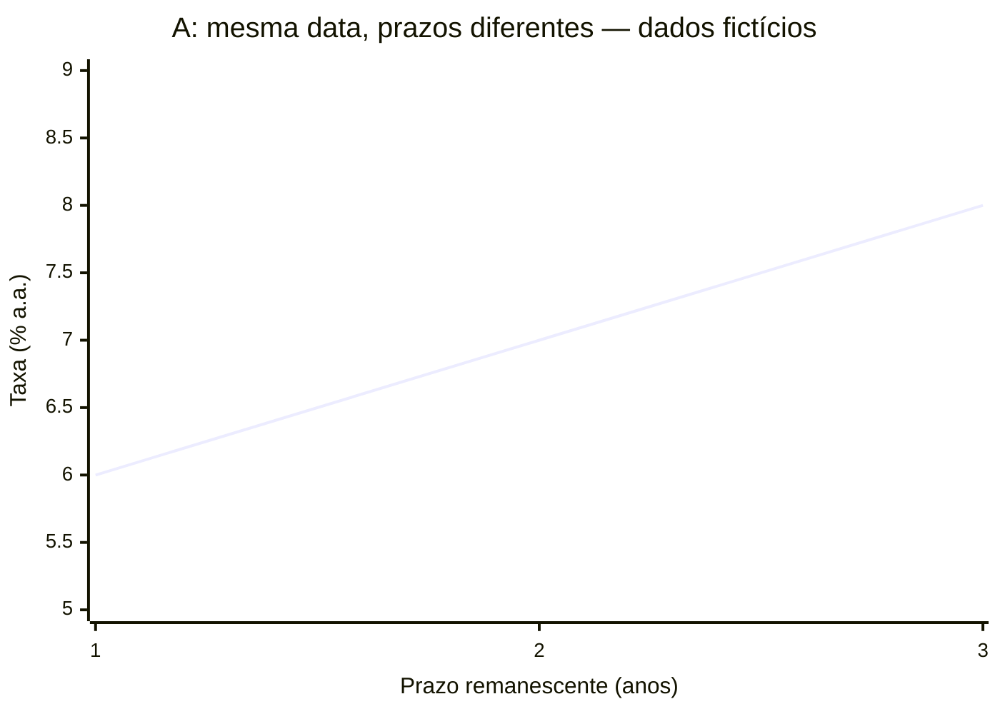

# MP-09 — Prazos e curva de juros

**Rascunho para revisão, não publicado.** B/C/E redigidas; revisão factual/editorial do autor; revisão independente/humana pendente; integração F não iniciada.

Fonte editorial: [mp-09-v1.mjs](mp-09-v1.mjs). Regenerar com `node docs/missao-bancaria/rascunhos/validate-mp01.mjs --unit=mp09 --render`.

Objetivo: Ler eixos, unidades e prazos de uma curva didática, comparar seus pontos e distinguir taxa de prazo específico, retorno acumulado e previsão do futuro.

<a id="retomada"></a>

## 1. Da taxa isolada à comparação de prazos

Retome porcentagens/períodos em [MP-03](mp-03-v1.md) e vencimento/preço em [MP-07](mp-07-v1.md). Prazo remanescente é quanto falta, a partir da data de observação, até o vencimento. Uma curva de juros relaciona taxas e prazos. Para uma comparação útil, informe data, moeda, tipo de taxa e características dos instrumentos. Misturar moedas, riscos ou convenções sem aviso pode atribuir ao prazo diferenças que vieram de outra característica.

Base conceitual: [BCE — Euro area yield curves](https://www.ecb.europa.eu/stats/financial_markets_and_interest_rates/euro_area_yield_curves/html/index.en.html). Consulta: 30/09/2026.

<a id="eixos"></a>

## 2. Como ler um gráfico antes de interpretar

O eixo horizontal, lido da esquerda para a direita, mostrará prazo remanescente em anos. O vertical, de baixo para cima, mostrará taxa em porcentagem ao ano (% a.a.). Um ponto combina as duas coordenadas. Os três pontos do gráfico A pertencem à mesma data fictícia e, por hipótese didática, a instrumentos comparáveis. A linha apenas conecta os pontos para facilitar a leitura; não adiciona observações intermediárias nem mostra um caminho no calendário. A tabela oferece os mesmos dados para leitura sem gráfico.

<a id="grafico-a"></a>

## 3. Gráfico A: uma fotografia fictícia dos prazos

Data fictícia A. Mesma moeda, mesma convenção de taxa anual e risco comparável por hipótese. Os números não são cotações brasileiras nem dados do BCE.

| Prazo remanescente (anos) | Taxa (% a.a.) |
| --- | --- |
| 1 | 6 |
| 2 | 7 |
| 3 | 8 |



<a id="exemplo-leitura"></a>

## 4. Exemplo resolvido: duas coordenadas, duas unidades

No gráfico A, localize 2 no eixo horizontal: significa dois anos até o vencimento, não o segundo ano de um histórico. Suba até o ponto; a taxa no eixo vertical é 7% a.a. Para um ano, o ponto mostra 6% a.a. Diferença: 7 − 6 = 1 ponto percentual. A comparação usa duas taxas na mesma data para prazos diferentes. Não diz que a taxa básica subirá de 6% para 7% daqui a um ano.

<a id="formas"></a>

## 5. Ascendente, descendente e plana

Uma curva ascendente tem taxas maiores nos prazos mais longos do recorte; descendente, menores; plana, aproximadamente iguais. São descrições da relação observada, não regras universais. A forma pode refletir expectativas e avaliação de riscos incorporadas aos preços. “Prêmio” designa aqui remuneração adicional exigida por riscos ou condições; não um bônus garantido. Uma leitura de tendência da curva não fornece certeza sobre inflação, recessão ou decisões futuras.

Base conceitual: [BCE — Euro area yield curves](https://www.ecb.europa.eu/stats/financial_markets_and_interest_rates/euro_area_yield_curves/html/index.en.html). Consulta: 30/09/2026.

<a id="exemplo-futuro"></a>

## 6. Exemplo resolvido: a foto não é um filme

Um estudante olha a curva A e diz: “O juro de três anos é 8%, então a Selic será exatamente 8% no terceiro ano”. Primeiro erro: o eixo mostra prazo remanescente, não uma sequência de futuras decisões do Copom. Segundo: taxa de determinado instrumento/prazo e taxa Selic são medidas diferentes. Terceiro: expectativas e riscos nos preços não garantem realização. A conclusão segura é apenas a taxa de 8% a.a. atribuída, no modelo e naquela data, ao prazo de três anos.

Base conceitual: [BCB — Taxa Selic](https://www.bcb.gov.br/controleinflacao/taxaselic). Consulta: 30/09/2026.

<a id="acumulado"></a>

## 7. Taxa anual e retorno acumulado não são iguais

Para entender a unidade, considere separadamente uma aplicação fictícia com taxa efetiva fixa de 10% ao ano durante dois anos, reinvestindo integralmente os juros, sem custos ou outras movimentações. Depois de um ano, multiplica-se por 1,10. No segundo, a nova base também é multiplicada por 1,10. Isso ensina a capitalização composta deste modelo; não é autorização para calcular todos os preços da curva, que dependeriam das convenções de cada instrumento.

<a id="exemplo-acumulado"></a>

## 8. Exemplo resolvido: usar a nova base

Partindo de 100 no modelo da seção anterior: ano 1, 100 × 1,10 = 110; ano 2, 110 × 1,10 = 121. O ganho de 21 sobre os 100 iniciais equivale a 21% acumulados em dois anos. 10% a.a. não significa 10% para todo o prazo; somar 10 + 10 daria 20%, diferente deste modelo composto. Não se devem aplicar esses números fictícios a um título real só pelo nome.

<a id="exemplo-comparar"></a>

## 9. Exemplo resolvido: mudança numa ponta

Outro par de fotografias fictícias comparáveis: antes, taxas de 5% para um ano e 7% para três; depois, 6% para um ano e 7% para três. A ponta curta subiu 1 ponto percentual; a longa não mudou. Logo, dizer “todas as taxas subiram igualmente” seria falso. O intervalo longa menos curta passou de 2 para 1 ponto percentual. Uma única taxa não resume toda a estrutura por prazos.

<a id="grafico-b"></a>

## 10. Gráfico B para uma nova leitura

Use este segundo conjunto fictício nas questões indicadas. Mesmas hipóteses de comparação interna do gráfico A, mas outra situação; não é uma série temporal de A para B.

| Prazo remanescente (anos) | Taxa (% a.a.) |
| --- | --- |
| 1 | 9 |
| 2 | 8 |
| 3 | 7 |

```mermaid
xychart-beta
  title "B: outra situação fictícia"
  x-axis "Prazo remanescente (anos)" [1, 2, 3]
  y-axis "Taxa (% a.a.)" 6 --> 10
  line [9, 8, 7]
```

<a id="glossario"></a>

## 11. Vocabulário de leitura

Prazo remanescente: tempo até vencer a partir da observação. Curva/estrutura a termo: relação entre taxas e prazos. Ponta curta/longa: prazos menores/maiores no recorte. Pontos percentuais: unidade de diferença entre porcentagens. Taxa anual: expressa em um ano segundo convenção indicada. Acumulado: variação ao longo de todo o intervalo. Expectativa: avaliação de futuro, não realização garantida.

<a id="resumo"></a>

## 12. Primeiro leia; depois limite a conclusão

Leia data, eixos e unidades; localize o ponto; compare prazos compatíveis; descreva a forma. Só então avalie se a frase pretendida vai além dos dados. Não trate curva como previsão infalível nem taxa anual como retorno acumulado. Ao recuperar um erro, escreva a coordenada completa e diga qual eixo ou período havia confundido.

## Recordação e recuperação

- Leia um ponto do gráfico B dizendo prazo, unidade e data fictícia.
- Explique por que uma fotografia da curva não é um histórico nem garantia do futuro.
- Após errar, retome a coordenada/base correta e refaça a comparação com um ponto diferente.

## Prática comentada

Todos os casos são fictícios. Tente responder antes de abrir cada comentário.

### Questão 1

No gráfico B, qual leitura corresponde ao ponto de dois anos?

A. 8% a.a. para prazo remanescente de dois anos, naquela situação fictícia.

B. 8% acumulados garantidos em quaisquer dois anos.

C. A inflação será 8% daqui a dois anos.

D. A Selic será necessariamente 8% no segundo ano.

<details>
<summary>Resposta e justificativas</summary>

**Resposta: A.** O ponto liga prazo e taxa na data de observação; não informa essas outras medidas.

- **A:** Lê as duas coordenadas.
- **B:** Troca unidade anual por acumulada e cria garantia.
- **C:** A curva não mede diretamente inflação futura.
- **D:** Troca prazo de instrumento por decisão futura.

Para recuperar: [2. Como ler um gráfico antes de interpretar](#eixos); [4. Exemplo resolvido: duas coordenadas, duas unidades](#exemplo-leitura); [10. Gráfico B para uma nova leitura](#grafico-b).

</details>

### Questão 2

Como descrever o gráfico B no recorte de um a três anos?

A. Plano, pois há três pontos.

B. Ascendente, porque o prazo cresce.

C. Descendente, porque a taxa cai de 9% para 7% conforme o prazo aumenta.

D. Histórico anual da Selic.

<details>
<summary>Resposta e justificativas</summary>

**Resposta: C.** A forma compara taxas por prazo, não a contagem de pontos nem passagem de anos.

- **A:** Quantidade de pontos não define forma.
- **B:** O crescimento do eixo não implica crescimento da taxa.
- **C:** Compara a direção das taxas corretamente.
- **D:** Confunde fotografia por prazo e histórico.

Para recuperar: [5. Ascendente, descendente e plana](#formas); [10. Gráfico B para uma nova leitura](#grafico-b).

</details>

### Questão 3

No gráfico B, a taxa de um ano supera a de três anos em quanto?

A. 2 reais.

B. 2 pontos percentuais.

C. Exatamente 2% de variação relativa da taxa de três anos.

D. 16 pontos percentuais.

<details>
<summary>Resposta e justificativas</summary>

**Resposta: B.** 9% − 7% = 2 pontos percentuais; a diferença não é um valor monetário.

- **A:** Usa unidade monetária para taxas.
- **B:** Nomeia corretamente a diferença.
- **C:** Confunde diferença em pontos e proporção relativa.
- **D:** Soma em vez de subtrair.

Para recuperar: [4. Exemplo resolvido: duas coordenadas, duas unidades](#exemplo-leitura); [10. Gráfico B para uma nova leitura](#grafico-b).

</details>

### Questão 4

O que uma taxa longa elevada permite afirmar sozinha sobre a decisão futura do Copom?

A. Que a taxa básica seguirá exatamente a mesma trajetória.

B. Que a inflação futura já está medida.

C. Que todo investimento terá ganho garantido.

D. Não determina essa decisão: instrumentos, expectativas e riscos precisam ser separados.

<details>
<summary>Resposta e justificativas</summary>

**Resposta: D.** Uma taxa observada por prazo não é uma sequência garantida de decisões monetárias.

- **A:** Transforma preço e expectativa em certeza.
- **B:** Confunde informação de mercado e medição futura.
- **C:** Cria garantia não presente.
- **D:** Mantém o limite da evidência.

Para recuperar: [5. Ascendente, descendente e plana](#formas); [6. Exemplo resolvido: a foto não é um filme](#exemplo-futuro).

</details>

### Questão 5

Modelo fictício: 100 a 5% efetivos ao ano por dois anos, reinvestindo juros, sem custos ou movimentações. Qual montante final?

A. 110, porque basta somar as taxas.

B. 105, pois a taxa só pode valer uma vez.

C. 110,25, calculando 100 × 1,05 × 1,05.

D. 125, porque dois anos significam elevar 5 ao quadrado e somar.

<details>
<summary>Resposta e justificativas</summary>

**Resposta: C.** Primeiro chega a 105; depois 105 × 1,05 = 110,25. O exemplo declara capitalização composta.

- **A:** Usa modelo simples em lugar do composto fornecido.
- **B:** Ignora o segundo período.
- **C:** Atualiza a base no segundo ano.
- **D:** Não usa fatores de crescimento.

Para recuperar: [7. Taxa anual e retorno acumulado não são iguais](#acumulado); [8. Exemplo resolvido: usar a nova base](#exemplo-acumulado).

</details>

### Questão 6

Taxas comparáveis: a curta passa de 4% para 5% e a longa permanece 6%. Qual afirmação é correta?

A. Toda a curva subiu 1 ponto percentual.

B. A curta subiu 1 ponto percentual, e o intervalo longa menos curta caiu de 2 para 1 ponto.

C. A longa caiu 1 ponto percentual.

D. Nenhuma taxa mudou.

<details>
<summary>Resposta e justificativas</summary>

**Resposta: B.** A mudança de um ponto da estrutura não implica mudança igual em todos.

- **A:** Generaliza a mudança curta.
- **B:** Calcula as diferenças nas duas fotografias.
- **C:** A taxa longa permaneceu 6%.
- **D:** Ignora a alteração curta.

Para recuperar: [9. Exemplo resolvido: mudança numa ponta](#exemplo-comparar).

</details>

### Questão 7

Duas taxas têm prazos diferentes, mas também moedas e riscos diferentes. Podemos atribuir toda a diferença apenas ao prazo?

A. Não: a comparação mistura outras características relevantes.

B. Sim, o prazo sempre explica tudo.

C. Sim, basta ambas conterem o símbolo %.

D. Não: taxas nunca podem ser comparadas em nenhum caso.

<details>
<summary>Resposta e justificativas</summary>

**Resposta: A.** É necessário controlar ou explicitar as características, em vez de supor comparabilidade.

- **A:** Identifica a limitação.
- **B:** Ignora moeda e risco.
- **C:** Unidade percentual sozinha não basta.
- **D:** Generaliza uma limitação específica.

Para recuperar: [1. Da taxa isolada à comparação de prazos](#retomada); [12. Primeiro leia; depois limite a conclusão](#resumo).

</details>

## Fontes e limites editoriais

- [BCE — Euro area yield curves](https://www.ecb.europa.eu/stats/financial_markets_and_interest_rates/euro_area_yield_curves/html/index.en.html): Página metodológica consultada em 30/09/2026; Definição da relação entre taxas e prazos remanescentes; expectativas e riscos. Apenas conceitos gerais, sem importar taxas ou método europeu ao Brasil.; consulta 2026-09-30.
- [BCB — Taxa Selic](https://www.bcb.gov.br/controleinflacao/taxaselic): Página institucional consultada em 30/09/2026; Definição da taxa efetiva nas compromissadas de um dia útil e atuação para alinhá-la à meta definida pelo Copom. Sem usar o valor atual.; consulta 2026-09-30.

- Gráficos inteiramente fictícios, com tabelas equivalentes para acessibilidade; não são cotações nem reprodução da curva brasileira.
- Estrutura a termo introdutória: sem estimação, interpolação, taxas a termo implícitas ou precificação completa.
- Modelo composto ensinado separadamente com taxa efetiva fixa, sem afirmar convenção de qualquer título real.
- Rascunho fora do catálogo; não é nova forma independente A/B, aceite de fase ou recomendação financeira.
