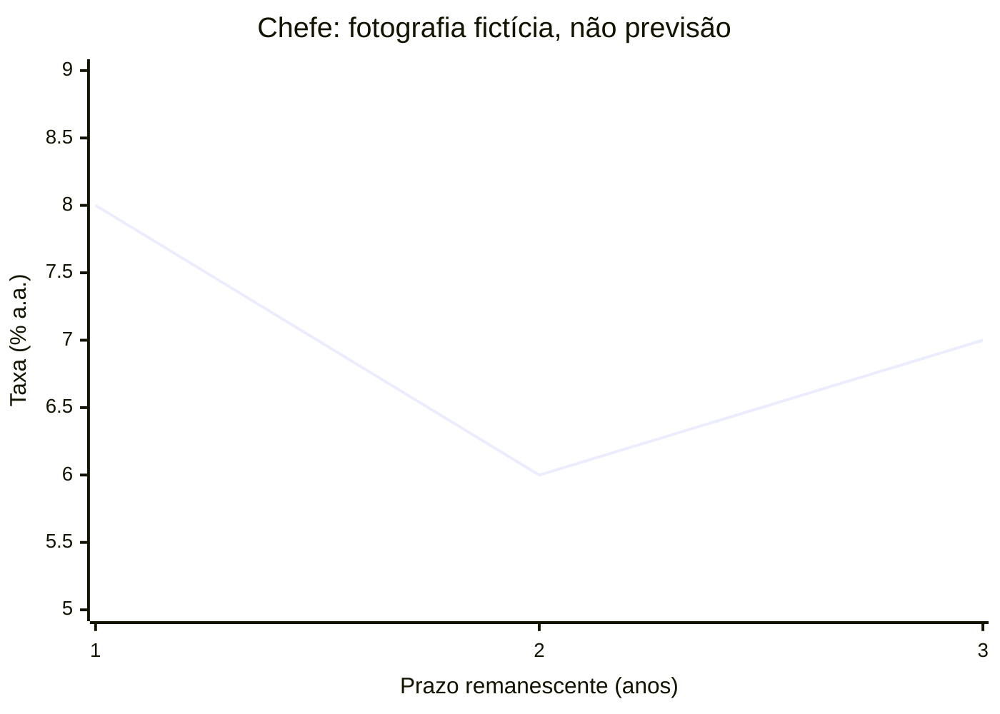

# MP-CHEFE — Chefe — conectar mercados, instrumentos e dívida

**Rascunho para revisão, não publicado.** Doze itens e apoio de recuperação redigidos; conferência do autor; revisão independente do Chefe e aceite de publicação pendentes; integração não iniciada.

Fonte editorial: [mp-chefe-v1.mjs](mp-chefe-v1.mjs). Regenerar com `node docs/missao-bancaria/rascunhos/validate-mp01.mjs --unit=mpchefe --render`.

Objetivo: Aplicar as distinções ensinadas em MP-01–09 a doze casos próprios, justificando a resposta e retomando o ensino de origem após erro.

## 1. Ensino e acesso antes do Chefe

Este desafio depende de [MP-01](mp-01-v1.md), [MP-02](mp-02-v1.md), [MP-03](mp-03-v1.md), [MP-04](mp-04-v1.md), [MP-05](mp-05-v1.md), [MP-06](mp-06-v1.md), [MP-07](mp-07-v1.md), [MP-08](mp-08-v1.md) e [MP-09](mp-09-v1.md) ensinadas e acessíveis. A [MP-R](mp-r-v1.md) permite preparar a revisão antes da tentativa. Hoje todos esses materiais são rascunhos fora do aplicativo. Não use o Chefe para substituir as aulas nem para cobrar um conceito antes de ler a origem indicada.

## 2. Um roteiro para os seis agrupamentos

Nos itens 1–2, identifique participantes, obrigação e quem atua apenas distribuindo. Nos 3–4, separe recursos próprios, crédito, datas e poder de compra. Nos 5–6, distinga objetivo, decisão, observação e atribuição causal. Nos 7–8, siga as duas pontas e as condições de cada instrumento. Nos 9–10, diferencie emissão, resgate, negociação e preço. Nos 11–12, leia prazo, unidade e base de capitalização. Os cenários e valores a seguir foram criados para esta prática; não representam ofertas ou taxas atuais.

## 3. Exemplo resolvido de preparação: a ordem das perguntas

Uma nota fictícia diz somente: “Uma instituição recebeu recursos ontem e fará um pagamento amanhã”. Passo 1: há duas datas, mas não sabemos se o pagamento é devolução desses mesmos recursos. Passo 2: faltam contraparte e obrigação, então não podemos concluir que houve compulsório, empréstimo ou compra de título. Passo 3: pedir esses dados é a conclusão adequada; o nome da instituição não completa o relato. O exemplo demonstra como evitar uma classificação inventada. Os itens do Chefe fornecem as hipóteses necessárias para uma resposta única.

## 4. Consulta antes de responder

Credor/devedor: participantes de um direito e de uma obrigação de pagamento. Distribuidor: quem participa da colocação do título; distribuição, por si, não transfere para ele a obrigação da emissora. Estoque/fluxo: posição numa data e movimento num intervalo. Preço de negociação: quantia paga numa troca, distinta do pagamento contratual no vencimento. Fator de crescimento: 1 mais a taxa decimal do período. Ponto percentual: unidade de diferença entre taxas. Consulte as explicações completas nas aulas vinculadas, se algum termo ainda não estiver claro.

## 5. Depois de um erro ou acerto com dúvida

Tente justificar sua resposta antes de abrir o comentário. Depois, compare também os distratores. Ao errar, retome o trecho de origem, marque o dado confundido e refaça as contas ou setas. As doze questões são novas em relação aos enunciados das aulas, mas ficam expostas nesta prévia: não são itens reservados para avaliação independente. Acertar o Chefe, especialmente depois de consultar respostas, não comprova retenção, prontidão ou aprovação. Nenhuma regra de XP, revisão adaptativa ou liberação foi implantada por este rascunho.

## Recordação e recuperação

- Antes da tentativa, indique a origem de um conceito que ainda precise retomar.
- Depois de responder, explique qual dado torna sua alternativa a única correta no caso.
- Ao recuperar um erro, altere um participante, valor ou prazo e refaça o raciocínio sem consultar o gabarito.

## Prática comentada

Todos os casos são fictícios. Tente responder antes de abrir cada comentário.

### Questão 1

Dois contratos fictícios e independentes: o banco Sol fornece 70 ao banco Lua; o banco Lua concede 14 de crédito à Oficina Norte. Quem deve pagar ao Sol no primeiro contrato e ao Lua no segundo, respectivamente?

A. Oficina Norte; banco Sol.

B. Banco Lua; banco Sol.

C. Banco Lua; Oficina Norte.

D. Oficina Norte; banco Lua.

Resposta e justificativas

**Resposta: C.** No primeiro contrato, Lua é tomador de Sol. No segundo, a oficina é tomadora de Lua. O caso não transfere a obrigação do banco para a oficina nem informa vinculação individual entre os dois financiamentos.

- **A:** A oficina não é tomadora de Sol; Sol não recebeu crédito no segundo contrato.
- **B:** Acerta o primeiro tomador, mas inverte o segundo contrato.
- **C:** Identifica o devedor de cada relação sem misturar contratos.
- **D:** Troca o tomador do primeiro e coloca o credor do segundo como seu próprio devedor.

Para recuperar: [2. Um roteiro para os seis agrupamentos](#roteiro); [4. Consulta antes de responder](#glossario).

Aula de origem: [MP-08: 2. Operações entre bancos](mp-08-v1.md#interbancario); [MP-08: 5. Exemplo resolvido: o mesmo número não faz a mesma operação](mp-08-v1.md#exemplo-varejo); [MP-01: 2. Crédito: receber recursos e assumir uma obrigação](mp-01-v1.md#credito).

### Questão 2

A companhia fictícia Mirante emite títulos de dívida. A instituição Horizonte faz apenas a distribuição, sem assumir garantia ou obrigação adicional, e Talita compra um título. Quem é o devedor dos pagamentos previstos nesse título?

A. Mirante, conforme as condições do título.

B. Horizonte, somente porque o distribuiu.

C. Talita, somente porque o comprou.

D. Horizonte e Talita, em lugar da emissora.

Resposta e justificativas

**Resposta: A.** A emissora Mirante é a devedora no título. A atuação de Horizonte como distribuidora, por si, não a torna responsável pelo pagamento da dívida da emissora aos investidores; o caso exclui obrigação adicional.

- **A:** Preserva a obrigação da emissora e as condições do instrumento.
- **B:** Confunde distribuir o título com assumir o pagamento da dívida.
- **C:** Talita adquire um direito pelo título; não assume a obrigação de sua emissora.
- **D:** Transfere a dívida para participantes que não a assumiram no caso.

Para recuperar: [2. Um roteiro para os seis agrupamentos](#roteiro); [4. Consulta antes de responder](#glossario).

Aula de origem: [MP-01: 4. Capitais: emitir instrumentos para captar recursos](mp-01-v1.md#capitais); [MP-01: 5. Exemplo resolvido: duas formas de financiar a mesma empresa](mp-01-v1.md#exemplo-capitais).

### Questão 3

No modelo fictício de uma conta, há R$ 46 de saldo próprio disponível hoje, limite de crédito ainda não utilizado de R$ 34 e recebimento previsto de R$ 20 amanhã. Um pagamento hoje deve usar exclusivamente recursos próprios já disponíveis, sem tarifas, outras saídas, contratação de crédito ou novas entradas. Qual valor máximo atende a essa condição?

A. R$ 100, somando os três valores.

B. R$ 80, juntando saldo e limite.

C. R$ 66, antecipando o recebimento.

D. R$ 46, considerando apenas o saldo próprio de hoje.

Resposta e justificativas

**Resposta: D.** O limite é possibilidade de crédito, não saldo próprio; o recebimento de amanhã não está disponível hoje. Pelas hipóteses expressas, só os R$ 46 atendem simultaneamente à origem e à data requeridas.

- **A:** Soma crédito não utilizado e entrada futura como se fossem recursos próprios atuais.
- **B:** Inclui um limite que o enunciado não permite contratar.
- **C:** Trata o recebimento futuro como dinheiro disponível no momento do pagamento.
- **D:** Respeita tanto a origem própria quanto a disponibilidade atual.

Para recuperar: [2. Um roteiro para os seis agrupamentos](#roteiro); [5. Depois de um erro ou acerto com dúvida](#recuperacao).

Aula de origem: [MP-02: 4. O cartão e o saldo respondem a perguntas diferentes](mp-02-v1.md#instrumento); [MP-02: 6. Saldo de hoje e recebimento futuro não são a mesma informação](mp-02-v1.md#datas); [MP-02: 10. O que verificar antes de concluir que o pagamento é possível](mp-02-v1.md#limites).

### Questão 4

Num único período fictício, uma quantia cresce 12% e a cesta de preços de referência encarece 8%. Sem custos, tributos, aportes ou retiradas, qual é o ganho real no modelo ensinado, arredondado a duas casas percentuais?

A. 4,00%, usando a diferença como resultado exato.

B. 3,70%, calculando (1,12 / 1,08 − 1) × 100.

C. 12,00%, usando apenas o crescimento da quantia.

D. −3,57%, calculando (1,08 / 1,12 − 1) × 100.

Resposta e justificativas

**Resposta: B.** O fator do dinheiro é dividido pelo fator dos preços: 1,12 / 1,08 − 1 = aproximadamente 0,037037. Em porcentagem, cerca de 3,70%. A subtração simples fornece aproximação, não a igualdade exata pedida.

- **A:** Usa a aproximação de quatro pontos como se fosse a taxa real exata.
- **B:** Compara os fatores na ordem e no período corretos, arredondando no final.
- **C:** Ignora o encarecimento da cesta.
- **D:** Inverte a razão entre o fator do dinheiro e o dos preços.

Para recuperar: [2. Um roteiro para os seis agrupamentos](#roteiro); [4. Consulta antes de responder](#glossario).

Aula de origem: [MP-03: 10. Taxa real: comparar os dois fatores](mp-03-v1.md#real); [MP-03: 11. Exemplo resolvido: ganho nominal e ganho real](mp-03-v1.md#exemplo-real); [MP-03: 12. Sinal, período e informação suficiente](mp-03-v1.md#limites).

### Questão 5

Relatório fictício: (I) buscar estabilidade de preços; (II) o Copom altera a meta Selic; (III) calcula-se a taxa média efetivamente praticada nas compromissadas federais de um dia útil. Qual classificação mantém as três informações distintas?

A. I: objetivo; II: decisão de política; III: taxa apurada nas operações.

B. I: taxa apurada; II: objetivo; III: decisão do Copom.

C. I: objetivo; II: inflação já medida; III: preço fixado para todo empréstimo.

D. I: decisão sobre a Selic; II: taxa de cada contrato; III: objetivo legal.

Resposta e justificativas

**Resposta: A.** A finalidade, a decisão sobre a meta e a taxa observada têm funções diferentes. A terceira informação é sobre as operações especificadas; não é a inflação nem a taxa de todos os contratos.

- **A:** Separa finalidade, decisão e observação operacional.
- **B:** Troca as três categorias apresentadas.
- **C:** Confunde juros e inflação e universaliza a taxa observada.
- **D:** Atribui à finalidade e aos dados sentidos que eles não têm.

Para recuperar: [2. Um roteiro para os seis agrupamentos](#roteiro); [5. Depois de um erro ou acerto com dúvida](#recuperacao).

Aula de origem: [MP-04: 2. Objetivo legal e escolhas de política](mp-04-v1.md#objetivos); [MP-04: 3. Meta Selic e Selic efetiva](mp-04-v1.md#selic); [MP-04: 4. Exemplo resolvido: não trocar decisão por resultado](mp-04-v1.md#exemplo-rotulos).

### Questão 6

Uma fábrica fictícia adia uma expansão. No mesmo mês, seu financiamento ficou mais caro e as encomendas de clientes externos diminuíram. Um analista atribui integralmente o adiamento à mudança dos juros. Qual avaliação usa apenas as evidências dadas?

A. A conclusão está provada, pois eventos no mesmo mês têm uma única causa.

B. A queda das encomendas prova que juros nunca afetam investimento.

C. Os dois fatores necessariamente explicam metade do efeito cada um.

D. O encarecimento pode influenciar o investimento, mas não foi isolado do efeito das encomendas.

Resposta e justificativas

**Resposta: D.** O encarecimento do financiamento pode influenciar a decisão de investir, mas existe outra mudança relevante. Sem separar influências, não se pode atribuir todo o resultado a um fator nem dividir percentuais de participação.

- **A:** Coincidência temporal não identifica uma causa exclusiva.
- **B:** Reconhecer outra influência não elimina o mecanismo monetário.
- **C:** Inventa uma repartição numérica sem dados.
- **D:** Reconhece mecanismo plausível e a limitação da atribuição causal.

Para recuperar: [2. Um roteiro para os seis agrupamentos](#roteiro); [5. Depois de um erro ou acerto com dúvida](#recuperacao).

Aula de origem: [MP-04: 5. Como uma decisão pode chegar ao gasto](mp-04-v1.md#transmissao); [MP-04: 6. Exemplo resolvido: custo do financiamento e investimento](mp-04-v1.md#exemplo-credito); [MP-04: 9. Tempo, choque de oferta e limite da conclusão](mp-04-v1.md#tempo).

### Questão 7

Num modelo fictício, hoje um banco entrega 250 ao BCB e recebe um título. Ficou combinado que, amanhã, o banco devolverá esse título ao BCB e receberá 253. Pela perspectiva do BCB, qual descrição é correta?

A. Compra com revenda: o BCB fornece 250 na ida e recebe 253 na volta.

B. Venda com recompra: o BCB recebe 250 na ida e paga 253 na volta.

C. Venda definitiva: o BCB recebe 250 e não há operação inversa prevista.

D. Depósito compulsório: o banco entrega 250 sem receber título ou pactuar retorno.

Resposta e justificativas

**Resposta: B.** As setas descritas mostram venda inicial pelo BCB e recompra combinada. A ponta inicial absorve 250 da disponibilidade do banco no modelo; a de retorno entrega 253, diferença de 3. Os valores não representam taxa ou leilão real.

- **A:** Inverte os fluxos de recursos dados no enunciado.
- **B:** Preserva participante, direção inicial e compromisso de retorno.
- **C:** Ignora o acordo explícito para amanhã.
- **D:** Troca a compra de título com retorno por uma obrigação de recolhimento não informada.

Para recuperar: [2. Um roteiro para os seis agrupamentos](#roteiro); [4. Consulta antes de responder](#glossario).

Aula de origem: [MP-05: 3. Compromissada: observar as duas pontas](mp-05-v1.md#compromissada); [MP-05: 4. Exemplo resolvido: absorção inicial de liquidez](mp-05-v1.md#exemplo-absorcao); [MP-05: 11. Comparar pela obrigação e pelo fluxo](mp-05-v1.md#comparacao).

### Questão 8

Três fichas fictícias: X — uma instituição financeira escolhe depósito remunerado no banco central, sob condições aplicáveis; Y — o banco central compra um título com compromisso de revendê-lo no prazo combinado; Z — em outro país, um programa compra ativos com reservas do banco central buscando influenciar juros mais longos, como no conceito estudado. Qual sequência classifica X, Y e Z?

A. Compulsório; compra definitiva; empréstimo pessoal.

B. QE; depósito voluntário; recolhimento obrigatório.

C. Depósito voluntário; compromissada; programa de QE no contexto descrito.

D. Compromissada; compulsório; depósito voluntário.

Resposta e justificativas

**Resposta: C.** X se distingue pela escolha de depositar; Y inclui uma operação inversa pactuada; Z descreve o programa de compras apresentado no ensino de QE. A comparação não transporta a política estrangeira ao Brasil nem equipara todos os instrumentos.

- **A:** Apaga a escolha de X, o retorno de Y e a compra de ativos de Z.
- **B:** Troca os mecanismos e atribui obrigatoriedade não descrita.
- **C:** Identifica o direito, a condição e a finalidade de cada ficha.
- **D:** Desconsidera as características decisivas das três operações.

Para recuperar: [2. Um roteiro para os seis agrupamentos](#roteiro); [5. Depois de um erro ou acerto com dúvida](#recuperacao).

Aula de origem: [MP-05: 3. Compromissada: observar as duas pontas](mp-05-v1.md#compromissada); [MP-06: 2. QE: a ideia e o caso britânico delimitado](mp-06-v1.md#qe); [MP-06: 5. QE e compromissada não são sinônimos](mp-06-v1.md#comparar); [MP-06: 6. Depósitos voluntários remunerados no Brasil](mp-06-v1.md#depositos).

### Questão 9

Dois planos fictícios partem do mesmo estoque de dívida de 600, sem juros, indexação ou outros ajustes. Ambos resgatam 80 de principal. O plano A emite 80; o plano B emite 110, usando os 30 adicionais para outros pagamentos. Quais são os estoques finais, A e B, respectivamente?

A. 520 e 520.

B. 680 e 710.

C. 600 e 600.

D. 600 e 630.

Resposta e justificativas

**Resposta: D.** Plano A: 600 − 80 + 80 = 600. Plano B: 600 − 80 + 110 = 630. Emitir exatamente o principal resgatado recompõe o financiamento; a emissão adicional de B aumenta o estoque no modelo. O uso dos recursos não elimina a obrigação emitida.

- **A:** Considera os resgates e ignora ambas as emissões.
- **B:** Considera as emissões e ignora os resgates.
- **C:** Trata a emissão adicional de B como se não criasse obrigação.
- **D:** Considera estoque inicial, resgate e emissão em cada plano.

Para recuperar: [2. Um roteiro para os seis agrupamentos](#roteiro); [4. Consulta antes de responder](#glossario).

Aula de origem: [MP-07: 3. Fluxo ao longo do período, estoque em uma data](mp-07-v1.md#fluxo-estoque); [MP-07: 4. Exemplo resolvido: necessidade e forma de financiamento](mp-07-v1.md#exemplo-fluxo); [MP-07: 6. Exemplo resolvido: refinanciar não é zerar a dívida](mp-07-v1.md#exemplo-estoque).

### Questão 10

Título fictício com pagamento único de 150 no vencimento: Dora comprou-o na emissão por 144, sem cupons ou outros pagamentos. Antes do vencimento, aceita vendê-lo a Enzo por 141. Desconsidere custos e tributos. Qual leitura descreve essa segunda negociação?

A. O emissor capta mais 141 e Dora continua titular do mesmo título.

B. Dora recebe 141 e realiza diferença bruta de −3 em relação à compra; Enzo passa a deter o direito do título.

C. Enzo recebe imediatamente 150 do emissor e Dora ganha 6 pela revenda.

D. Dora recebe obrigatoriamente 150 na revenda porque esse é o pagamento previsto no vencimento.

Resposta e justificativas

**Resposta: B.** Enzo paga os 141 à vendedora Dora; 141 − 144 = −3. A troca de titular não é automaticamente nova captação do emissor. O pagamento contratual de 150 no vencimento não fixa o preço de venda antecipada.

- **A:** Confunde revenda com emissão e ignora a transferência do título.
- **B:** Segue o destinatário do pagamento, o resultado bruto da venda e a mudança de titular.
- **C:** Antecipa pagamento do emissor que não ocorreu e troca o preço efetivo da venda.
- **D:** Confunde pagamento no vencimento com preço negociado antes dele.

Para recuperar: [2. Um roteiro para os seis agrupamentos](#roteiro); [4. Consulta antes de responder](#glossario).

Aula de origem: [MP-07: 7. Mercado primário e negociação posterior](mp-07-v1.md#emissao-negociacao); [MP-07: 8. Exemplo resolvido: seguir o pagamento até o destinatário](mp-07-v1.md#exemplo-secundario); [MP-07: 9. Três leituras básicas da remuneração](mp-07-v1.md#remuneracao); [MP-07: 11. Exemplo resolvido: valor prometido e preço de venda](mp-07-v1.md#exemplo-preco).

### Questão 11

O gráfico e a tabela mostram a mesma fotografia inteiramente fictícia: mesma data, moeda, convenção de taxa anual e instrumentos comparáveis por hipótese. Qual leitura respeita os pontos e os limites da informação?

| Prazo remanescente (anos) | Taxa (% a.a.) |
| --- | --- |
| 1 | 8 |
| 2 | 6 |
| 3 | 7 |

A. As taxas aumentam continuamente de um a três anos.

B. A taxa de dois anos garante que a Selic será 6% no segundo ano.

C. A taxa de três anos supera a de dois em 1 ponto percentual, mas está abaixo da de um ano.

D. O investimento de três anos renderá exatamente 7% acumulados em todo o prazo.

Resposta e justificativas

**Resposta: C.** Os pontos mostram 8%, 6% e 7% a.a. por prazo na mesma data. De dois para três anos a diferença é 7 − 6 = 1 ponto percentual; a taxa de três anos continua abaixo de 8%. O desenho não é uma sequência de decisões futuras nem informa retorno acumulado de 7%.

- **A:** Ignora a queda de 8% para 6% entre os dois primeiros prazos.
- **B:** Transforma uma taxa por prazo em garantia de política futura.
- **C:** Compara corretamente dois pares de pontos e suas unidades.
- **D:** Confunde taxa anual indicada com retorno de todo o período.

Para recuperar: [2. Um roteiro para os seis agrupamentos](#roteiro); [4. Consulta antes de responder](#glossario).

Aula de origem: [MP-09: 2. Como ler um gráfico antes de interpretar](mp-09-v1.md#eixos); [MP-09: 5. Ascendente, descendente e plana](mp-09-v1.md#formas); [MP-09: 6. Exemplo resolvido: a foto não é um filme](mp-09-v1.md#exemplo-futuro); [MP-09: 9. Exemplo resolvido: mudança numa ponta](mp-09-v1.md#exemplo-comparar).

### Questão 12

Modelo fictício de capitalização composta: 300 aplicados por três anos completos a 6% efetivos ao ano, taxa fixa, com reinvestimento integral, sem custos, tributos, aportes ou retiradas. Multiplique pela nova base a cada ano e arredonde somente o montante final a duas casas. Qual resultado e leitura são corretos?

A. 357,30: 300 × 1,06 × 1,06 × 1,06; os 6% são anuais, não o ganho de todo o prazo.

B. 354,00: acrescentar 18% à base inicial reproduz exatamente o modelo composto.

C. 318,00: aplicar o fator 1,06 uma vez basta para os três anos.

D. 360,00: todo prazo de três anos transforma 6% anuais em 20% acumulados.

Resposta e justificativas

**Resposta: A.** Ano 1: 318. Ano 2: 337,08. Ano 3: 357,3048, arredondado para 357,30. Reinvestimento faz o fator atuar sobre a nova base. Não se pressupõe essa convenção em um produto real; ela está expressa no modelo.

- **A:** Aplica os três fatores e arredonda apenas o montante final.
- **B:** Usa acréscimo simples de 18%, diferente da composição especificada.
- **C:** Ignora dois períodos de crescimento.
- **D:** Inventa uma conversão para 20% sem relação com os fatores dados.

Para recuperar: [2. Um roteiro para os seis agrupamentos](#roteiro); [4. Consulta antes de responder](#glossario).

Aula de origem: [MP-09: 7. Taxa anual e retorno acumulado não são iguais](mp-09-v1.md#acumulado); [MP-09: 8. Exemplo resolvido: usar a nova base](mp-09-v1.md#exemplo-acumulado).

## Fontes e limites editoriais

- [CVM — Funcionamento do Sistema Financeiro Nacional](https://www.gov.br/investidor/pt-br/investir/como-investir/conheca-o-mercado-de-capitais/funcionamento-do-sistema-financeiro-nacional): Página publicada em 25/10/2022; Parágrafos de segmentação, monetário, câmbio e crédito; consulta 2026-09-30.
- [CVM — O Mercado de Valores Mobiliários](https://www.gov.br/investidor/pt-br/investir/como-investir/conheca-o-mercado-de-capitais/o-mercado-de-valores-mobiliarios): Página publicada em 25/10/2022; Comparação crédito/capitais; prestação de serviços; dívida e participação; consulta 2026-09-30.
- [BCB — Caderno de Educação Financeira](https://www.bcb.gov.br/content/cidadaniafinanceira/documentos_cidadania/Cuidando_do_seu_dinheiro_Gestao_de_Financas_Pessoais/caderno_cidadania_financeira.pdf): 2026, 2ª edição revisada; Seções 3.1 e 3.4, páginas impressas 32 e 35; consulta 2026-09-30.
- [CVM — Mercado Primário x Mercado Secundário](https://www.gov.br/investidor/pt-br/investir/como-investir/como-funciona-a-bolsa/mercado-primario-x-mercado-secundario): Página publicada em 26/08/2022; Parágrafos sobre novas emissões e negociação entre investidores; consulta 2026-09-30.
- [Banco Central Europeu — O que é a moeda?](https://www.ecb.europa.eu/ecb-and-you/explainers/tell-me-more/html/what_is_money.pt.html): Atualização de 19/06/2024; Como a moeda é utilizada: três funções. Usado somente para conceitos gerais, não para regras brasileiras ou emissão do euro.; consulta 2026-09-30.
- [BCB — O que é instituição de pagamento?](https://www.bcb.gov.br/pre/composicao/instpagamento.asp?frame=1): Página educacional legada, sem data editorial exibida; Instrumento de pagamento, movimentação sem moeda em espécie e registro de transações. Normas listadas nessa página não são tratadas como vigentes nesta aula.; consulta 2026-09-30.
- [BCB — Caderno de Educação Financeira](https://www.bcb.gov.br/content/cidadaniafinanceira/documentos_cidadania/Cuidando_do_seu_dinheiro_Gestao_de_Financas_Pessoais/caderno_cidadania_financeira.pdf): 2026, 2ª edição revisada; Seções 2.1, orçamento; 3.1, crédito; 5.3, liquidez de investimentos, páginas impressas 23, 32 e 60–61; consulta 2026-09-30.
- [Banco Central Europeu — O que é a inflação?](https://www.ecb.europa.eu/ecb-and-you/explainers/tell-me-more/html/what_is_inflation.pt.html): Página explicativa, sem data editorial exibida; Aumento geral dos preços, ponderação, hábitos de consumo e comparação de cestas. Sem transpor IHPC, meta ou números europeus ao Brasil.; consulta 2026-09-30.
- [BCB — Caderno de Educação Financeira](https://www.bcb.gov.br/content/cidadaniafinanceira/documentos_cidadania/Cuidando_do_seu_dinheiro_Gestao_de_Financas_Pessoais/caderno_cidadania_financeira.pdf): 2026, 2ª edição revisada; Seção 3.2, valor do dinheiro no tempo e juros, página impressa 32. Não utilizada como fonte de uma taxa de mercado.; consulta 2026-09-30.
- [Lei Complementar 179/2021](https://www.planalto.gov.br/ccivil_03/leis/lcp/lcp179.htm): Texto consultado em 30/09/2026; Artigos 1º e 2º: objetivos do BCB e metas de política monetária estabelecidas pelo CMN.; consulta 2026-09-30.
- [BCB — Taxa Selic](https://www.bcb.gov.br/controleinflacao/taxaselic): Página institucional consultada em 30/09/2026; Definição da taxa efetiva nas compromissadas de um dia útil e atuação para alinhá-la à meta definida pelo Copom. Sem usar o valor atual.; consulta 2026-09-30.
- [BCB — Mecanismos de transmissão da política monetária](https://www.bcb.gov.br/controleinflacao/transmissaopoliticamonetaria): Página institucional consultada em 30/09/2026; Canais de consumo/investimento, câmbio, ativos, crédito e expectativas; efeitos condicionais, sem estimar magnitude ou prazo.; consulta 2026-09-30.
- [BCB — Recolhimentos compulsórios](https://www.bcb.gov.br/estabilidadefinanceira/recolhimentoscompulsorios): Página institucional consultada em 30/09/2026; Recolhimento obrigatório ao BCB, liquidez e estabilidade financeira. Não utilizada para alíquotas atuais.; consulta 2026-09-30.
- [Lei 4.595/1964](https://www.planalto.gov.br/ccivil_03/leis/l4595.htm): Redação dos incisos V e XII do artigo 10 dada pela LC 179/2021, consultada em 30/09/2026; Competências do BCB para redesconto/empréstimo e operações com títulos federais, sob regulamentação; não confundir trechos revogados com vigentes.; consulta 2026-09-30.
- [Bank of England — Quantitative easing](https://www.bankofengland.co.uk/monetary-policy/quantitative-easing): Página atualizada em 05/12/2025, consultada em 30/09/2026; Conceito de compras de títulos com reservas e transmissão para juros mais longos; contexto britânico iniciado em março de 2009. Não transpor política, meta ou situação atual ao Brasil.; consulta 2026-09-30.
- [Lei 14.185/2021 — depósitos voluntários](https://www.planalto.gov.br/ccivil_03/_ato2019-2022/2021/lei/l14185.htm): Lei de 14/07/2021, publicada em 15/07/2021; texto consultado em 30/09/2026; Artigos 1º e 3º: autorização, remuneração definida pelo BCB e condições regulamentares; não informa taxa vigente.; consulta 2026-09-30.
- [Tesouro Nacional — Sobre Política Fiscal](https://www.gov.br/tesouronacional/pt-br/estatisticas-fiscais-e-planejamento/sobre-politica-fiscal): Atualização de 08/07/2022, consultada em 30/09/2026; Receitas/despesas, fluxos/estoques e resultado primário; exemplo didático não reproduz contabilidade fiscal oficial.; consulta 2026-09-30.
- [Lei 4.320/1964 — orçamento e execução](https://www.planalto.gov.br/ccivil_03/leis/l4320.htm): Texto consultado em 30/09/2026; Arts. 47–50, 90 e 102: limites autorizados, programação, execução e comparação entre previsão e realização. Sem apresentar processo orçamentário completo.; consulta 2026-09-30.
- [Decreto 12.814/2026 — títulos públicos](https://www.planalto.gov.br/ccivil_03/_ato2023-2026/2026/decreto/d12814.htm): Decreto de 09/01/2026, DOU de 12/01/2026; consultado em 30/09/2026; Arts. 2º, 3º, 7º e 11: LTN/LFT/NTN-B/NTN-F. Arts. 31–32: revogação do Decreto 11.301/2022 e vigência na publicação. Recorte introdutório, sem listar todas as séries.; consulta 2026-09-30.
- [CVM — Mercado primário x mercado secundário](https://www.gov.br/investidor/pt-br/investir/como-investir/como-funciona-a-bolsa/mercado-primario-x-mercado-secundario): Publicação de 26/08/2022, consulta reaproveitada em 30/09/2026; Emissão/captação e negociação de títulos existentes; exemplos delimitados ao emissor e às contrapartes indicadas.; consulta 2026-09-30.
- [CVM — Funcionamento do Sistema Financeiro Nacional](https://www.gov.br/investidor/pt-br/investir/como-investir/conheca-o-mercado-de-capitais/funcionamento-do-sistema-financeiro-nacional): Publicação de 25/10/2022, consulta reaproveitada em 30/09/2026; Segmentos monetário, de crédito, de capitais e cambial; operações entre bancos e BCB. Não descreve organograma obrigatório de um banco.; consulta 2026-09-30.
- [BCE — Euro area yield curves](https://www.ecb.europa.eu/stats/financial_markets_and_interest_rates/euro_area_yield_curves/html/index.en.html): Página metodológica consultada em 30/09/2026; Definição da relação entre taxas e prazos remanescentes; expectativas e riscos. Apenas conceitos gerais, sem importar taxas ou método europeu ao Brasil.; consulta 2026-09-30.

- Fontes e fatos já verificados nas aulas de origem, reaproveitados sem nova auditoria normativa.
- Cenários, valores e gráfico são fictícios; condições de cálculo explícitas, sem taxa atual ou recomendação.
- Os doze itens são próprios deste Chefe, mas expostos em documentação: não compõem nova forma de avaliação independente.
- Ensino e acesso às aulas anteriores são dependências antes de qualquer liberação. Revisão independente do ensino não valida automaticamente estes novos itens.
- Sem IDs produtivos, XP, limiar de domínio, liberação, migração ou mudança de progresso. A/B e fases do projeto permanecem separadas.
