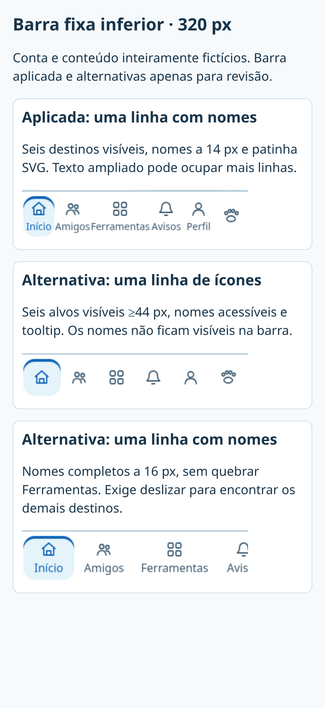
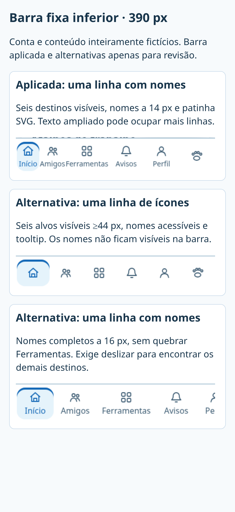
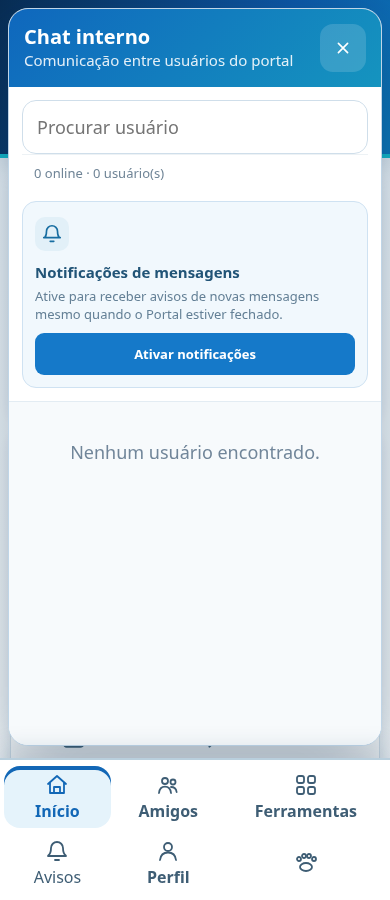
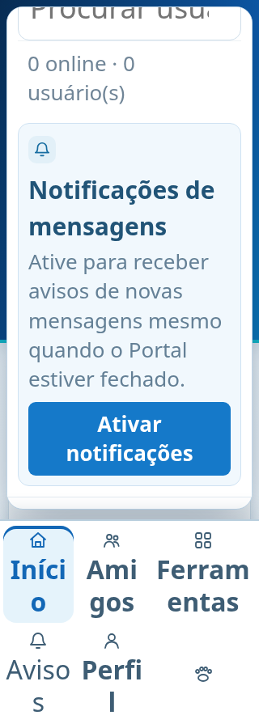
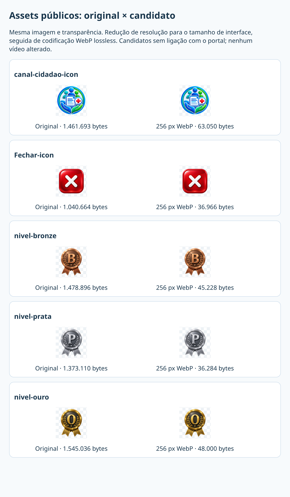

# Revisão concreta: navegação, mascote/chat e assets

Capturas de fixture cidadão, sem contas, posts ou pacientes reais. A implementação final aplica a barra em uma linha com nomes a 14 px e patinha SVG, conforme escolha autorizada. Texto ampliado reflui para mais linhas; todos os destinos permanecem acessíveis. As demais opções são injetadas somente no harness.

| Opção em 320 px | Altura da barra | Alvos | Compromisso |
| --- | --- | --- | --- |
| Uma linha, aplicada | 72 px | ≥44×58 px | Seis destinos e cinco nomes completos a 14 px; texto ampliado reflui sem corte. |
| Uma linha, ícones | 66 px | 52×52 px | Alternativa de revisão, sem nomes visíveis. |
| Uma linha, rolável | 76 px | ≥72×62 px | Alternativa de revisão que exige deslizar; não aplicada. |

Mascotes é exclusivamente a patinha SVG com nome acessível. Ferramentas mantém seu nome completo. O harness verifica os limites de cada rótulo/alvo e a adaptação ao texto ampliado. As capturas comparativas são evidência sintética, sem substituir testes em aparelhos reais.

A barra usa o token de superfície existente sem translucidez: texto do conteúdo atrás não atravessa a navegação. A nova camada aberta de chat fica em z-index 12001, acima do mascote global (12000), mantendo runtime, movimentação e contagem do pet intactos. O harness verifica essa ordem e o acesso por rolagem ao botão de notificações. Captura normal em 390 px e texto duplicado em 320 px:

## Compressão preparada, sem integrar aos clientes

Todos os cinco originais são PNG RGBA transparentes de 1254×1254 px. Candidatos de 256×256 px preservam a imagem e alpha, reduzem resolução e codificam WebP lossless; a redução de resolução não é lossless. Não houve criação ou substituição de identidade visual. Não se alterou o vídeo ou o contrato de dez segundos.

| Asset | Original bytes | Candidato bytes | Uso no cidadão |
| --- | ---: | ---: | --- |
| Canal | 1.461.693 | 63.050 | Favicon, marca e card Ferramentas; `cidadao/index.html`, `account-brand.js`, `tools-catalog.js`. |
| Fechar | 1.040.664 | 36.966 | Fundos de botões de formulário/detalhe/perfil, geralmente 42–52 px. Também compartilhado com módulos fora do lote. |
| Bronze | 1.478.896 | 45.228 | Progressão e segurança da conta, `account-levels.js`. |
| Prata | 1.373.110 | 36.284 | Mesmo componente. |
| Ouro | 1.545.036 | 48.000 | Mesmo componente. |
| Total | 6.899.399 | 229.528 | Redução de bytes crus de 96,67%; não é economia garantida por visita. |

Medalhas são exibidas em 68 px no celular e 82 px em outro layout, com estado atual scale(1.08). 256 px serve esses usos até aproximadamente DPR 3; em DPR 4, considerar variante 384 px/srcset. Favicon e botões não devem baixar 1254 px. Originais mantidos; candidatos em `asset-candidates/` não são referenciados pelo portal.

Origem: Canal entrou em `b1602346` (2026-08-17), Fechar em `57c44e6c` (2026-08-21) e medalhas em `4c655d5a` (2026-08-20), com mensagem “Add files via upload”. Comentário de CSS descreve Fechar como asset profissional enviado. Não encontrei licença explícita para esses arquivos nem metadados de autoria: não atribuo licença de dependências aos assets. São transformações locais dos mesmos arquivos já no repo, sem novas imagens externas.

Próxima implementação de velocidade: ligar variantes apenas nos clientes cidadão, antes do primeiro request; preservar PNG fallback e arquivos compartilhados de módulos institucionais. Apenas trocar src depois do carregamento gastaria os dois arquivos. A escolha WebP/PNG, DPR e cores deve ser validada com capturas e rede local; coordenar cache separadamente, sem reescrever runtime global. Tempos de fixture e tamanhos de disco não são CWV nem transferência comprimida de produção.

## Reprodução

`REVIEW_CAPTURES=1` grava a barra atual e o chat; `NAV_REVIEW=icons` ou `scroll` ou `compact` injeta apenas a alternativa no harness. Execute com `ROUTES=/ WIDTHS=320,390`. `review-nav.mjs` monta as duas comparações a partir de `/tmp/citizen-nav-*.png`; `review-assets.mjs` lê somente os cinco assets locais e seus candidatos, sem rede. O workflow publica as capturas como artefatos.

Candidatos foram criados por ImageMagick: `magick assets/NOME.png -resize 256x256 -define webp:lossless=true testing/citizen-layout/asset-candidates/NOME.webp`. Revisão de pixels não prova todos os DPRs/aparelhos. O mapa de acessos e a matriz geral estão em [README.md](README.md).

Cache: `account-section-shell.js` recebe referência versionada nova somente na página Mascotes. O SW existente mantém assets versionados; HTML usa atualização em segundo plano. Uma sessão já em cache pode precisar de uma nova navegação após receber o HTML atualizado. O PR preserva o cache global e as versões `pets-combined-v8`.
